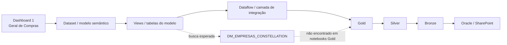
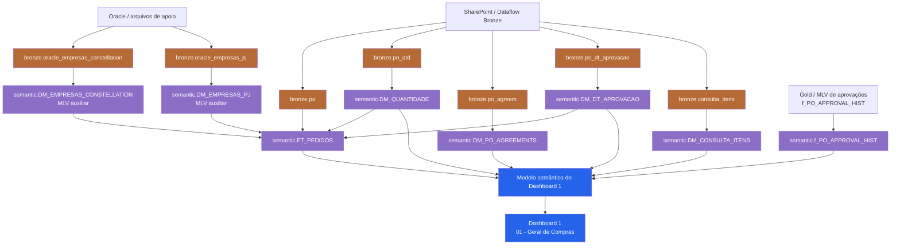

# Dashboard 1 — revisão da linhagem

Data da revisão: 2026-09-17  
Escopo: `01 - Geral de Compras` / `Relatório Geral de Compras`.

## Conclusão executiva

`DM_EMPRESAS_CONSTELLATION` existe na camada semântica como Materialized Lake
View (MLV). Portanto, a ausência de um notebook `DM_EMPRESAS_CONSTELLATION`
na pasta Gold não é uma lacuna de dados: é uma classificação incorreta da
linhagem quando o scanner procura somente notebooks Gold.

O elo correto é:

`Bronze oracle_empresas_constellation` → `semantic.DM_EMPRESAS_CONSTELLATION`
→ `semantic.FT_PEDIDOS` → modelo semântico → Dashboard 1.

## Diagrama da Rafa — reconstrução do material observado

O desenho abaixo representa a hierarquia visível nos prints e na planilha,
não uma prova de que todos os elos abaixo sejam dependências de execução:

### Problema do desenho

- A hierarquia mistura artefatos de consumo, transformação e origem em uma
  única cadeia.
- O prefixo `DM_` foi usado como indício de Gold; isso falha para MLVs
  semânticas.
- O Dataflow aparece como se fosse necessariamente o pai de todas as tabelas;
  no caso analisado ele atualiza Bronze SharePoint e não substitui as
  dependências SQL dos notebooks semânticos.
- A relação `MLV → fato` não aparece explicitamente.
- Uma tabela auxiliar semântica não deve ser ligada diretamente ao Dataset
  sem evidência de que está exposta no modelo; normalmente ela alimenta outra
  tabela consumida pelo Dataset.

## Diagrama correto — Dashboard 1

### Ordem operacional mínima

1. Atualizar as fontes Bronze (Dataflow/SharePoint e demais produtores).
2. Executar as MLVs semânticas auxiliares e dimensões.
3. Executar `FT_PEDIDOS` depois de `DM_EMPRESAS_CONSTELLATION`,
   `DM_EMPRESAS_PJ`, `DM_DT_APROVACAO` e `DM_QUANTIDADE`.
4. Executar/atualizar `DM_PO_AGREEMENTS`, `DM_CONSULTA_ITENS` e a cadeia de
   aprovações conforme suas dependências.
5. Atualizar o modelo semântico e só então validar o Dashboard 1.

## O que falta no material da Rafa para ficar correto

| Item | Situação observada | Correção necessária |
|---|---|---|
| Camada semântica MLV | Não separada de Gold | Criar o tipo `semantic`/`MLV` no inventário e nos diagramas |
| `DM_EMPRESAS_CONSTELLATION` | Procurada em notebooks Gold | Procurar também notebooks/definitions semânticos e parsear o SQL |
| Origem da DM | Elo Bronze não explícito | Registrar `bronze.oracle_empresas_constellation` como fonte |
| Consumidor da DM | Relação não demonstrada | Registrar `DM_EMPRESAS_CONSTELLATION → FT_PEDIDOS`; Dataset só se a DM estiver exposta |
| Hierarquia | Fato e dimensões sem ordem executável | Registrar dependências e ordem topológica |
| Dataflow | Tratado como origem universal | Separar produtor Bronze, transformação SQL e consumidor semântico |
| Nomes `DW_`/`PR_` | Podem ser comparados só por nome | Manter alias como hipótese até comprovar item/SQL/contrato |
| Aceite | Planilha/print são estáticos | Separar existência no catálogo, execução, refresh do modelo e valor visual |

## Resposta direta à dúvida do mapping

Sim, uma Bronze virar uma view/tabela `DM_*` sem existir uma Gold com o mesmo
nome faz sentido neste projeto. O nome `DM_*` identifica o papel lógico no
modelo, não garante a camada física. Neste caso, a definição SQL materializa a
MLV em `semantic` e o `FT_PEDIDOS` a utiliza por `Supplier_Number`.

O mapping está correto quando registra, no mínimo:

`Bronze → MLV semântica DM_* → tabela consumidora → modelo semântico`.

Não é correto concluir “faltou a Gold `DM_EMPRESAS_CONSTELLATION`”. O que
faltava era representar a camada semântica e o elo intermediário no mapa de
linhagem.

## Evidências locais usadas

- Definição HML: `/home/victorannn/Constellation/Projeto-ETL-Constelatium/projects/faturamento_oracle/reports/general_purchases_semantic_split_hml_20260826/definitions/nb_VW_MV_semantic_DM_EMPRESAS_CONSTELLATION.definition.json`
- Manifest semântico: `/home/victorannn/Constellation/Projeto-ETL-Constelatium/projects/faturamento_oracle/reports/general_purchases_semantic_split_hml_20260826/manifests/nb_VW_MV_semantic_DM_EMPRESAS_CONSTELLATION.yaml`
- SQL consumidor: `/home/victorannn/Constellation/Projeto-ETL-Constelatium/projects/faturamento_oracle/reports/relatorio_geral_compras_hml_correction_20260904/nb_VW_MV_semantic_FT_PEDIDOS.corrected.sql`
- Inventário comparativo: `/home/victorannn/Constellation/supervisor_comparativo_20260916_121509.xlsx`
- Prints da validação: `/home/victorannn/Imagens/Capturas de tela/call_explicacao_atividades_rafaela_17_set_10_00/`

Essas evidências comprovam a definição e a relação estática; não substituem
uma confirmação de execução/refresh no Fabric.
